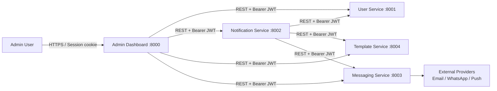
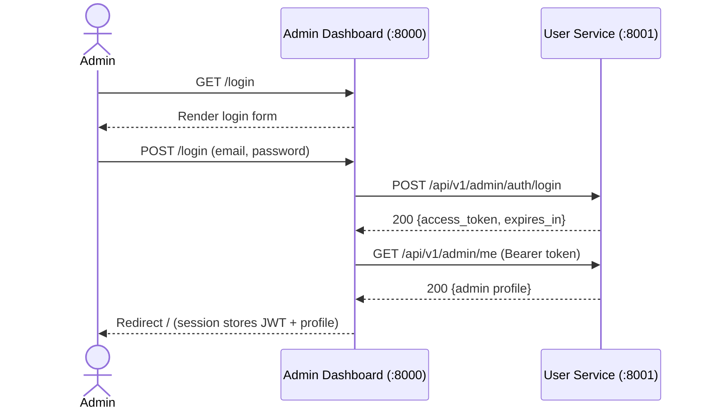
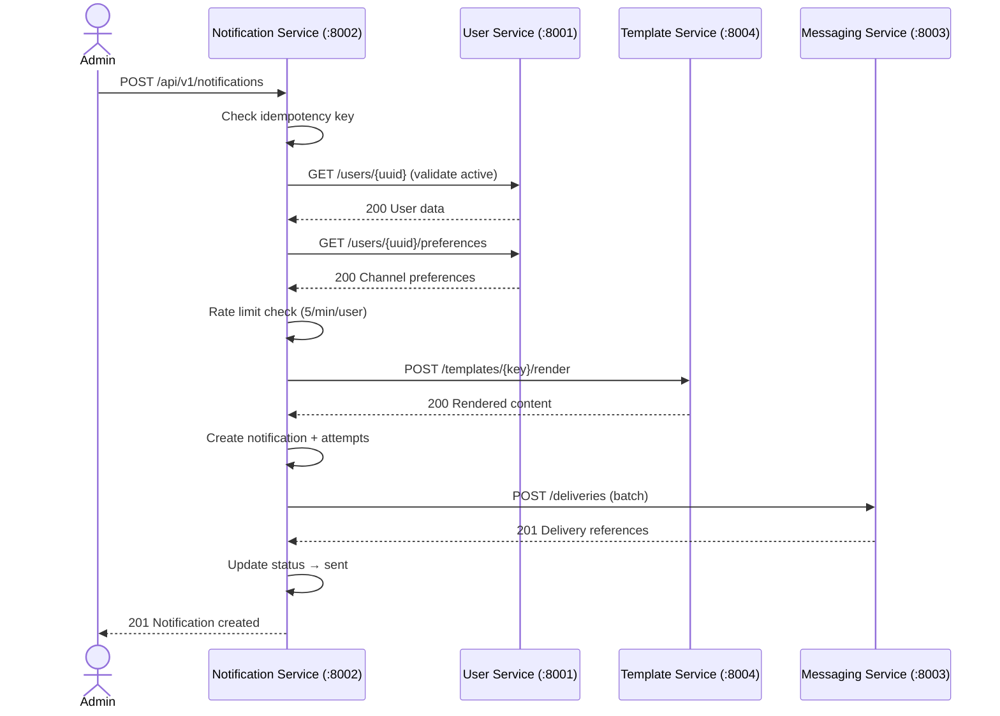
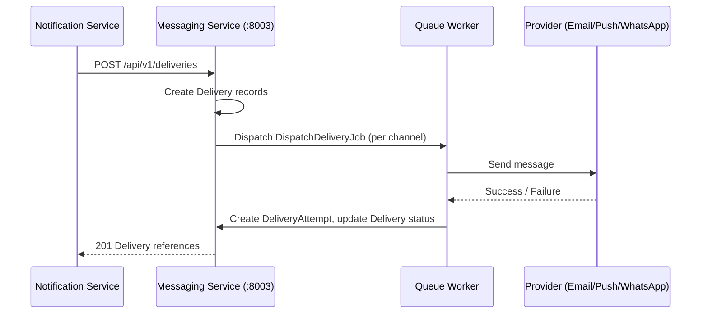
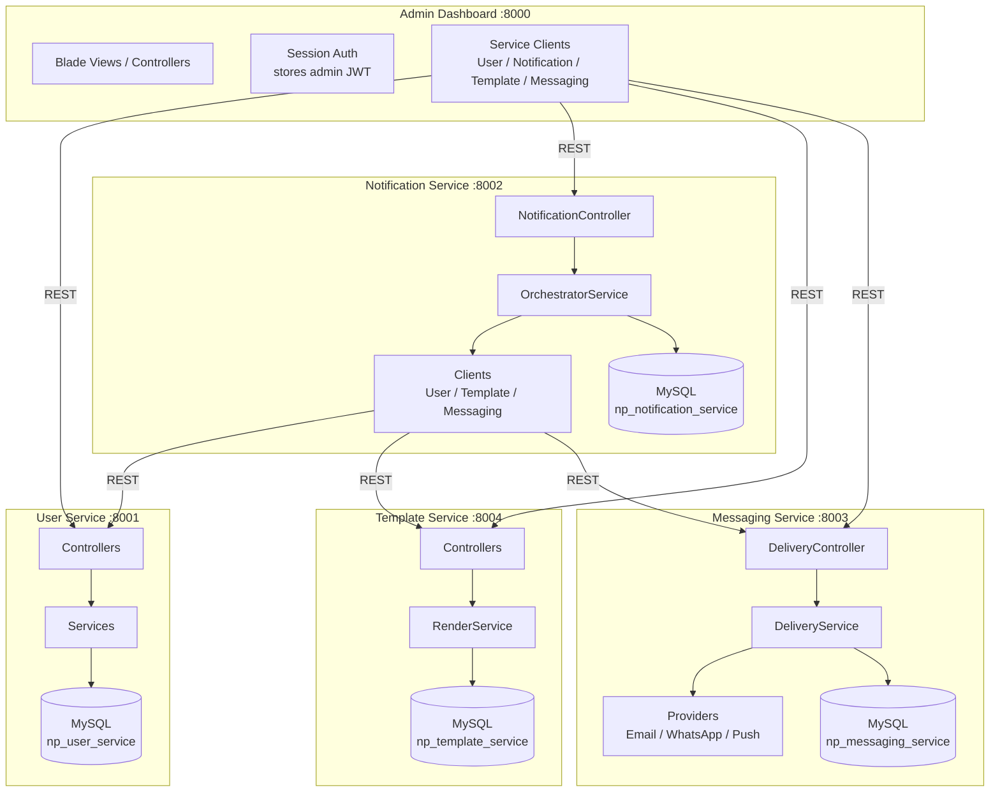

# Architecture

## Services & Ports

| Service | Type | Port | Database | Primary Responsibilities |
|---------|------|------|----------|-------------------------|
| Admin Dashboard | Laravel web app (Blade + Tailwind) | 8000 | `np_admin_dashboard` | Admin UI, session auth, orchestration via REST |
| User Service | Laravel API (stateless JSON) | 8001 | `np_user_service` | Admin auth (JWT), admin CRUD, recipient users, preferences, devices |
| Notification Service | Laravel API + queue workers | 8002 | `np_notification_service` | Notification orchestration, idempotency, rate limiting, status tracking |
| Messaging Service | Laravel API + queue workers | 8003 | `np_messaging_service` | Channel provider abstraction, delivery dispatch, attempt tracking |
| Template Service | Laravel API | 8004 | `np_template_service` | Template CRUD, versioning, variable-based rendering |

---

## Auth Model

- **Admin authentication** is issued by **User Service** (`POST /api/v1/admin/auth/login`). Returns an RS256-signed JWT with role claims (`admin` or `super_admin`).
- Admin Dashboard stores the JWT server-side in the session and caches the admin profile from `GET /api/v1/admin/me`. The browser only holds a session cookie.
- All API services validate the JWT using the User Service's public key via `JwtAdminAuthMiddleware`.
- Recipient users are managed entities with no authentication flow — they are created and managed by admins.

See [auth.md](auth.md) for the full auth deep-dive.

---

## Data Ownership

- Each service owns its database schema. No cross-service DB access.
- Admins and recipient users live in **User Service**.
- Admin Dashboard stores only session/cache data — no business entities.
- Cross-service data is accessed exclusively via REST APIs.

See [database-ownership.md](database-ownership.md) for the full table inventory.

---

## Inter-Service Communication

All communication is synchronous REST over HTTP/JSON. Every request carries:
- `Authorization: Bearer <JWT>` — forwarded from the original admin request
- `X-Correlation-Id` — for distributed tracing across service boundaries

```
Admin Dashboard (8000)
  ├──► User Service (8001)           [Auth, users, preferences, devices]
  ├──► Notification Service (8002)   [Create/view notifications, retry]
  ├──► Messaging Service (8003)      [View delivery status]
  └──► Template Service (8004)       [Manage templates]

Notification Service (8002)
  ├──► User Service (8001)           [Validate user, fetch preferences]
  ├──► Template Service (8004)       [Render template]
  └──► Messaging Service (8003)      [Dispatch deliveries]
```

**User Service** and **Template Service** are leaf services — they do not call other internal services.

---

## Diagrams

### System Context



### Sequence: Admin Login



### Sequence: Create Notification (Orchestration)



### Sequence: Message Delivery



### Component Diagram


