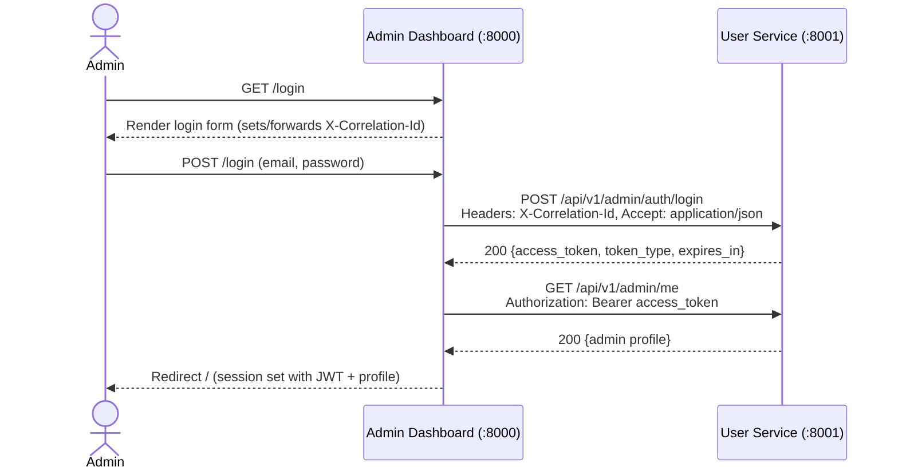
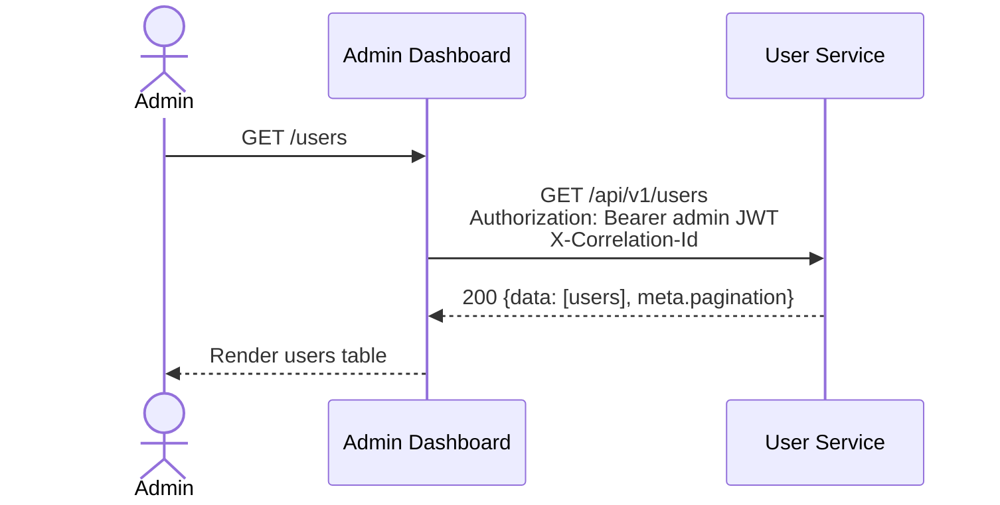

# Notification Platform Architecture

## Services & Ports
| Service | Type | Port | Primary Responsibilities | Data Ownership |
| --- | --- | --- | --- | --- |
| Admin Dashboard | Laravel web app (server-rendered) | 8000 | Admin UI, session auth, orchestration of user/template/notification actions via internal APIs | Admin accounts, dashboard settings |
| User Service | Laravel API (stateless JSON) | 8001 | Admin auth (JWT), admin profile, recipient user CRUD, preferences, devices | Admins, Users, Preferences, Devices |
| Notification Service | Laravel API + workers | 8002 | Notification creation, scheduling, rendering coordination, delivery tracking | Notifications, Schedules, Delivery logs |
| Messaging Service | Laravel API + workers | 8003 | Channel provider abstraction, dispatch, provider failover, delivery callbacks | Messages, Provider configs |
| Template Service | Laravel API | 8004 | Template CRUD, versioning, rendering | Templates, Template versions |

## Auth Model
- **Admin authentication** is issued by **User Service** (`POST /api/v1/admin/auth/login`). Returns a JWT (`access_token`, `expires_in`, `token_type`).
- Admin Dashboard stores the JWT server-side in the session and caches the admin profile fetched from `GET /api/v1/admin/me`. Browser only holds the session cookie.
- Admin routes in User Service require the `Authorization: Bearer <JWT>` header; dashboard enforces its own session middleware before rendering pages.
- Recipient users (non-admin) are managed via User Service APIs; no roles/permissions for users.

## Data Ownership
- Each service owns its database schema; no cross-service DB access.
- Admins and recipient user records live in **User Service**; Admin Dashboard persists only admin session state and UI settings.
- Notifications, templates, messages, and preferences remain within their respective services; cross-service reads are via HTTP calls only.

## Correlation ID Propagation
- Middleware in both Admin Dashboard and User Service ensures every request has `X-Correlation-Id` (generated as UUID when absent) and echoes it in responses.
- Admin Dashboard forwards the same header on outbound calls to User Service so request chains can be traced end-to-end.
- Structured JSON logs include `correlation_id` for inbound and outbound events.

## Diagrams

### System Context
```mermaid
graph LR
    Admin[Admin User] -->|HTTPS\nSession cookie| AD[Admin Dashboard :8000]
    AD -->|REST JSON\nAuthorization: Bearer| US[User Service :8001]
    AD -->|REST JSON| NS[Notification Service :8002]
    AD -->|REST JSON| TS[Template Service :8004]
    AD -->|REST JSON| MS[Messaging Service :8003]
    NS --> TS
    NS --> US
    NS --> MS
    MS --> Ext[External Providers\n(Twilio, Mailgun, FCM, APNs)]
```

### Sequence: Admin Login


### Sequence: User Management (list users)


### Component Diagram (logical)
```mermaid
graph TD
    subgraph Admin Dashboard (:8000)
        UI[Blade Views / Controllers]
        AuthSess[Session Auth\nstores admin JWT]
        Client[UserServiceClient\n(Guzzle)]
        UI --> AuthSess
        UI --> Client
    end

    subgraph User Service (:8001)
        Middleware[Correlation & JWT Middleware]
        Controllers[Admin/User Controllers]
        Domain[Domain Services]
        DB[(MySQL np_user_service)]
        Controllers --> Domain --> DB
    end

    UI -->|REST| Controllers
    Client -->|REST| Controllers
```
