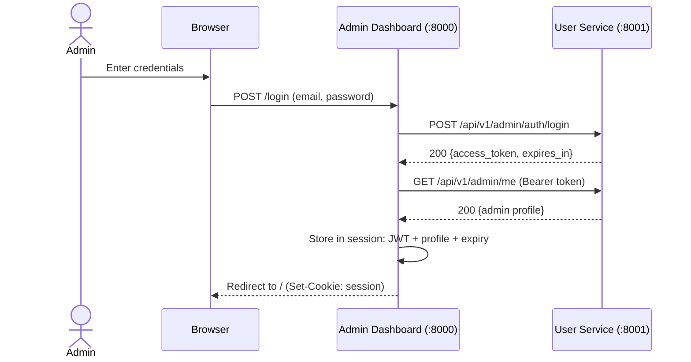

# Authentication & Authorization

This document explains how identity, authentication, and authorization work across all services in the Notification Platform.

---

## Overview

The platform uses **RS256 JWT tokens** for all service-to-service and admin authentication. There is a single identity provider: the **User Service**. All other services validate tokens using the User Service's public key.

There are no end-user (recipient) authentication flows — recipients are managed entities, not authenticated actors.

---

## Admin JWT Auth Flow

### Token Issuance

1. Admin submits credentials to Admin Dashboard (`POST /login`).
2. Dashboard forwards credentials to User Service (`POST /api/v1/admin/auth/login`).
3. User Service validates email/password against the `admins` table.
4. On success, User Service issues an RS256-signed JWT containing:

```json
{
  "iss": "user-service",
  "aud": "notification-platform",
  "sub": "admin-uuid-here",
  "type": "admin",
  "role": "super_admin",
  "iat": 1742000000,
  "exp": 1742003600
}
```

5. Dashboard stores the JWT and admin profile in the server-side session (not in the browser).
6. Browser only holds a Laravel session cookie.

### Token Validation

Every API service (User Service, Template Service, Notification Service, Messaging Service) has a `JwtAdminAuthMiddleware` that:

1. Extracts the `Authorization: Bearer <token>` header.
2. Decodes and verifies the RS256 signature using the User Service's public key.
3. Validates `iss`, `aud`, `exp`, and `type` claims.
4. Attaches the decoded admin claims to the request for downstream use.
5. Returns a standardized 401 error envelope if the token is missing, expired, or invalid.

### Key Management

```bash
# Generate RSA key pair in User Service
cd services/user-service
php artisan jwt:generate-keys
# Creates: storage/app/keys/jwt-private.pem, storage/app/keys/jwt-public.pem
```

Other services need access to the **public key only** — configured via:

```env
# Option A: File path
JWT_PUBLIC_KEY=storage/app/keys/jwt-public.pem

# Option B: Inline content (for environments without shared filesystem)
JWT_PUBLIC_KEY_CONTENT="-----BEGIN PUBLIC KEY-----\n..."
```

---

## Dashboard Session Management



### Session Contents

| Key | Value |
|-----|-------|
| `admin_jwt_token` | The raw JWT string |
| `admin_profile` | Admin UUID, name, email, role |
| `admin_jwt_expires_at` | ISO 8601 expiry timestamp |

### Session Expiry & Logout

- The dashboard checks `admin_jwt_expires_at` on each request.
- If the JWT has expired, the session is invalidated and the admin is redirected to `/login`.
- `HandleUnauthorizedRemoteMiddleware` catches 401 responses from User Service and triggers automatic logout.
- For other services (Template, Notification, Messaging), a 403 response preserves the session — the admin stays logged in but sees a "Forbidden" page.

---

## Protected Routes

### API Services (JWT Middleware)

All API routes (except `/health`) are protected by `jwt.admin` middleware:

```php
Route::middleware('jwt.admin')->group(function () {
    // All protected routes
});
```

### Super Admin Gates

Some operations are restricted to `super_admin` role only:

| Service | Gated Operations |
|---------|-----------------|
| User Service | Admin CRUD, toggle active |
| Template Service | Template CRUD (create, update, delete, list, show) |
| Admin Dashboard | Admin management pages, template management pages |

These are enforced by `RequireSuperAdminMiddleware` (alias: `admin.super`):

```php
Route::middleware('admin.super')->group(function () {
    // Super admin only routes
});
```

### Dashboard (Session Middleware)

Dashboard web routes use session-based middleware:

| Middleware | Purpose |
|-----------|---------|
| `RequireAdminSessionMiddleware` | Verifies active session with valid JWT |
| `RequireSuperAdminMiddleware` | Checks `admin_profile.role === 'super_admin'` |

---

## Correlation ID in Auth Flows

Every authentication-related request carries and propagates `X-Correlation-Id`:

1. Dashboard generates a correlation ID for the login request.
2. The ID is forwarded to User Service during credential validation.
3. User Service includes the ID in its structured logs (login success/failure).
4. On subsequent requests, the dashboard forwards the session's JWT along with a fresh correlation ID to downstream services.
5. All services echo the correlation ID in their response headers.

This enables tracing a single admin's login → action → downstream call chain across all service logs.

---

## JWT Configuration

Each service that validates JWTs uses `config/jwt.php`:

```php
return [
    'issuer'   => env('JWT_ISSUER', 'user-service'),
    'audience' => env('JWT_AUDIENCE', 'notification-platform'),
    'keys' => [
        'public'         => env('JWT_PUBLIC_KEY', storage_path('app/keys/jwt-public.pem')),
        'public_content' => env('JWT_PUBLIC_KEY_CONTENT'),
    ],
];
```

User Service additionally has the private key for signing:

```php
'keys' => [
    'private' => env('JWT_PRIVATE_KEY', storage_path('app/keys/jwt-private.pem')),
    'public'  => env('JWT_PUBLIC_KEY', storage_path('app/keys/jwt-public.pem')),
],
```
