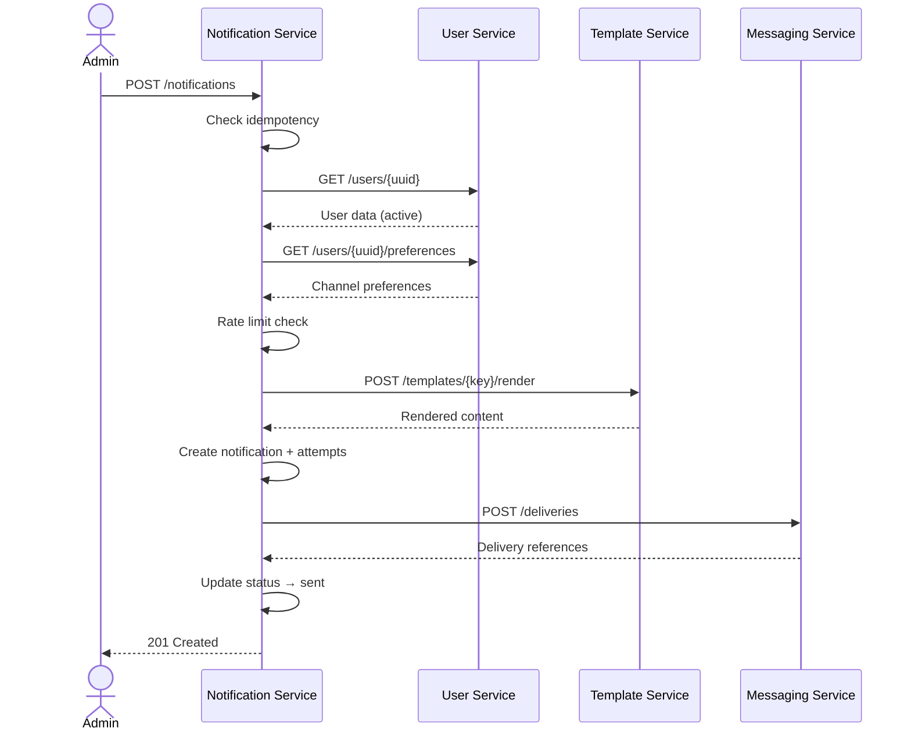

# Request Flows

Step-by-step documentation of key flows through the system, showing which services are involved and what happens at each step.

---

## Admin Login

**Actor:** Admin user via browser

1. Admin visits `GET /login` on **Admin Dashboard** (:8000).
2. Dashboard renders the login form.
3. Admin submits `POST /login` with email and password.
4. Dashboard calls **User Service** (:8001) `POST /api/v1/admin/auth/login` with credentials.
5. User Service validates credentials against the `admins` table.
6. User Service returns `{access_token, token_type, expires_in}`.
7. Dashboard calls **User Service** `GET /api/v1/admin/me` with the new token.
8. User Service returns the admin profile (uuid, name, email, role).
9. Dashboard stores JWT + profile + expiry in the server-side session.
10. Dashboard redirects the admin to `/` (dashboard home).

---

## Create Recipient User

**Actor:** Authenticated admin via Dashboard or direct API

1. Admin submits user data (name, email, phone) to **Admin Dashboard** `POST /users`.
2. Dashboard forwards to **User Service** (:8001) `POST /api/v1/users` with Bearer token + correlation ID.
3. User Service validates the payload (unique email, required fields).
4. User Service creates the user in `np_user_service.users` with auto-generated UUID.
5. User Service creates default preferences in `np_user_service.user_preferences`.
6. User Service returns 201 with the created user data.
7. Dashboard redirects to the user detail page with a success flash.

---

## Create Template

**Actor:** Super admin via Dashboard or direct API

1. Super admin submits template data (key, name, channel, subject, body, variables_schema).
2. Dashboard forwards to **Template Service** (:8004) `POST /api/v1/templates` with Bearer token.
3. Template Service validates:
   - `key` is unique and alpha_dash format
   - `channel` is one of: email, whatsapp, push
   - Required fields present
4. Template Service creates the template in `np_template_service.templates` with version 1.
5. Template Service returns 201 with the created template.

---

## Create Notification (Full Orchestration)

**Actor:** Authenticated admin via Dashboard or direct API

This is the most complex flow in the system. It involves 4 services.

1. Admin submits notification data to **Notification Service** (:8002) `POST /api/v1/notifications`:
   ```json
   {
     "user_uuid": "...",
     "template_key": "welcome_email",
     "channels": ["email", "push"],
     "variables": {"name": "Alex"},
     "idempotency_key": "idem-001"
   }
   ```

2. **Idempotency check** — Notification Service queries `idempotency_keys` table. If `(user_uuid, idempotency_key)` exists, returns the existing notification immediately. No duplicate processing.

3. **Validate user** — Notification Service calls **User Service** (:8001) `GET /api/v1/users/{uuid}`. Verifies the user exists and `is_active === true`. If not, returns error.

4. **Fetch preferences** — Notification Service calls **User Service** `GET /api/v1/users/{uuid}/preferences`. Intersects requested channels with user's enabled channels. If no channels remain, returns error.

5. **Rate limiting** — Notification Service checks cache: max 5 notifications per minute per user. If exceeded, returns 429.

6. **Render template** — Notification Service calls **Template Service** (:8004) `POST /api/v1/templates/{key}/render` with the provided variables. Template Service validates variables against schema and returns compiled subject + body.

7. **Create notification** — Notification Service creates the notification in `np_notification_service.notifications` with status `queued`.

8. **Store idempotency key** — Creates record in `idempotency_keys` with SHA-256 hash of the request payload.

9. **Create attempts** — Creates `NotificationAttempt` records for each channel (e.g., one for email, one for push).

10. **Dispatch to Messaging Service** — Notification Service calls **Messaging Service** (:8003) `POST /api/v1/deliveries` with per-channel delivery items:
    ```json
    {
      "notification_uuid": "...",
      "user_uuid": "...",
      "deliveries": [
        {"channel": "email", "recipient": "user@example.com", "subject": "...", "content": "..."},
        {"channel": "push", "recipient": "device-token", "content": "..."}
      ]
    }
    ```

11. **Messaging Service processes** — Creates `Delivery` records, dispatches `DispatchDeliveryJob` for each channel.

12. **Update status** — Notification Service updates the notification status to `sent` (or `failed` if messaging service returned an error). Stores delivery references.

13. Returns 201 with the notification data including attempts.



---

## Render Template

**Actor:** Any authenticated admin (via Notification Service or direct API)

1. Caller sends `POST /api/v1/templates/{key}/render` to **Template Service** with variables.
2. Template Service loads the template by key.
3. If the template is inactive, returns 409 Conflict.
4. Template Service validates provided variables against the template's `variables_schema`.
5. Template Service performs variable substitution on subject and body.
6. Returns rendered subject + body + channel metadata.

---

## Dispatch to Messaging Service

**Actor:** Notification Service (programmatic)

1. Notification Service calls **Messaging Service** `POST /api/v1/deliveries` with a batch of delivery items.
2. Messaging Service creates a `Delivery` record for each item in `np_messaging_service.deliveries`.
3. For each delivery, Messaging Service dispatches a `DispatchDeliveryJob` to the queue.
4. The job selects the appropriate provider based on channel:
   - `email` → `EmailProvider` (sends via `Mail::raw()`)
   - `whatsapp` → `WhatsappProvider` (stub)
   - `push` → `PushProvider` (stub)
5. Provider sends the message and returns a `provider_message_id`.
6. Messaging Service creates a `DeliveryAttempt` record with the result.
7. On success: delivery status → `sent`, `sent_at` is set.
8. On failure: delivery status → `failed`, error stored, `attempts_count` incremented.

---

## Retry Failed Notification

**Actor:** Authenticated admin

1. Admin calls `POST /api/v1/notifications/{uuid}/retry` on **Notification Service**.
2. Notification Service loads the notification and verifies it exists.
3. Notification Service resets the notification for retry processing.
4. Returns success response with retry acceptance.

---

## Retry Failed Delivery

**Actor:** Authenticated admin

1. Admin calls `POST /api/v1/deliveries/{uuid}/retry` on **Messaging Service**.
2. Messaging Service loads the delivery and verifies `attempts_count < max_attempts`.
3. Resets delivery status to `pending`, clears error, resets attempts count.
4. Dispatches a new `DispatchDeliveryJob`.
5. Returns success response.
